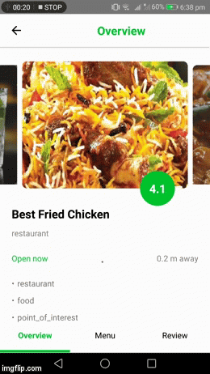
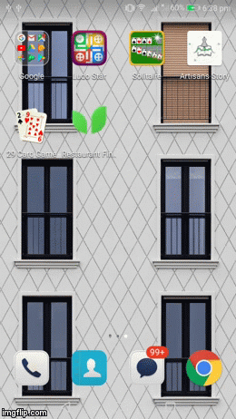

# Restaurant Finder

#### From the name you can assume that it finds restaurants for you. It displays near by restaurants in map and in feed . It gives direction how to go to a particular place.For authentication I used Facebook and Google sign In api maintained by Redux state. This nearly has the urges to use database. For that i used AsyncStorage. All the information displayed are from google map and places API. For that i used libraries like which uses google map and places in the background.

Download the APK : [Installable APK](https://github.com/ishraqe/restaurant/raw/master/apk/app-release.apk)

## Preview

## How to create your own copy of this app?
### Prerequisites
To create an own copy of this application, you have some prerequisites. They are -

 - [NodeJS](https://nodejs.org/en/) installed on your system.
 - [React Native](https://facebook.github.io/react-native/) installed on your system.
 - Have the [Android SDK](https://developer.android.com/studio/index.html) and paths set properly. 
 - An android emulator or real device to run the app.
 - A google account for having [Firebase Web](https://firebase.google.com/docs/web/setup) configuration.

### Make own copy
First clone the repository using:

    git clone https://github.com/ishraqe/restaurant.git

Then install the dependencies using:

    npm install

 Run the following command to run the app on the emulator.

    react-native run-android
Now, you have your own copy of this application!

## License
Do anything you wanna do!

## Credits
All credit goes to all library creators and contributors to those libraries and those awesome people from whome i have collected contents from.

## Built With
The project is built on top of react-native using the following major libraries:

* [react-native-router-flux](https://github.com/aksonov/react-native-router-flux) - for a navigation system
* [redux](https://redux.js.org/) - for state management
* [redux-thunk](https://github.com/reduxjs/redux-thunk) - for managing async actions
* [react-native-fbsdk](https://github.com/facebook/react-native-fbsdk) - for sign in/up with facebook
* [react-native-google-signin](https://github.com/react-native-community/react-native-google-signin) - for sign in/up with google
* [react-native-communications](https://github.com/anarchicknight/react-native-communications) - for calling from device
* [react-native-google-places](https://github.com/tolu360/react-native-google-places) - for places from gooogle map
* [react-native-maps](https://github.com/react-community/react-native-maps) - for google map
* [react-native-scrollable-tab-view](https://github.com/happypancake/react-native-scrollable-tab-view) - for a scrollable tab
* [react-native-snap-carousel](https://github.com/archriss/react-native-snap-carousel) - for carousel 
* [react-native-vector-icons](https://github.com/oblador/react-native-vector-icons) - for vector icons 
* [react-native-video](https://github.com/react-native-community/react-native-video) - for playing video

Made with ♥ by [Ishraqe Manjur](https://twitter.com/ishraqe_manjur)
